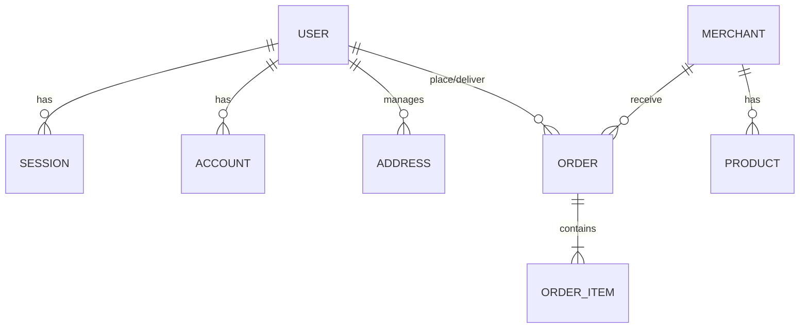

# Skema Database: KoncoKirim (Lite)

Dokumen ini merinci desain database menggunakan **SQLite (Turso)** dan **Drizzle ORM**. Skema ini dirancang untuk mendukung fitur *offline-first*, *hybrid order flow*, dan *courier auction* sesuai [PRD.md](./PRD.md).

## 1. Tabel Autentikasi (Better-auth)

Tabel ini dikelola oleh Better-auth namun kita menambahkan ekstensi pada tabel `user` untuk kebutuhan bisnis.

### `user`
Menyimpan data identitas semua aktor (Admin, Kurir, Customer).
| Kolom | Tipe Data | Deskripsi |
| :--- | :--- | :--- |
| `id` | text (PK) | UUID format string. |
| `name` | text | Nama lengkap user. |
| `email` | text (Unique) | Digunakan untuk login. |
| `emailVerified` | boolean | Status verifikasi email. |
| `image` | text | URL foto profil. |
| `role` | text | Enum: `ADMIN`, `COURIER`, `CUSTOMER`. |
| `phoneNumber` | text (Unique) | Nomor WhatsApp aktif. |
| `otpCode` | text | Kode OTP untuk verifikasi login. |
| `otpExpiresAt` | timestamp | Waktu kedaluwarsa kode OTP. |
| `createdAt` | timestamp | Waktu pendaftaran. |
| `updatedAt` | timestamp | Waktu pembaruan terakhir. |

### `session`
Menyimpan data sesi aktif user.
| Kolom | Tipe Data | Deskripsi |
| :--- | :--- | :--- |
| `id` | text (PK) | ID sesi. |
| `userId` | text (FK) | Pemilik sesi (Ref: `user.id`). |
| `token` | text (Unique) | Token sesi. |
| `expiresAt` | timestamp | Waktu sesi berakhir. |
| `ipAddress` | text | Alamat IP user. |
| `userAgent` | text | User agent browser/perangkat. |

### `account`
Menyimpan data akun provider (OAuth/Password).
| Kolom | Tipe Data | Deskripsi |
| :--- | :--- | :--- |
| `id` | text (PK) | ID akun. |
| `userId` | text (FK) | Pemilik akun (Ref: `user.id`). |
| `providerId` | text | ID provider (e.g., 'password'). |
| `accountId` | text | ID unik dari provider. |
| `password` | text | Hash password (jika menggunakan provider password). |

### `verification`
Menyimpan data verifikasi (Email/OTP).
| Kolom | Tipe Data | Deskripsi |
| :--- | :--- | :--- |
| `id` | text (PK) | ID verifikasi. |
| `identifier` | text | Identifier (email/phone). |
| `value` | text | Nilai yang diverifikasi. |
| `expiresAt` | timestamp | Waktu kedaluwarsa. |

---

## 2. Tabel Profil & Alamat

### `address`
Daftar alamat pengiriman yang disimpan oleh customer.
| Kolom | Tipe Data | Deskripsi |
| :--- | :--- | :--- |
| `id` | text (PK) | ID unik alamat. |
| `userId` | text (FK) | Pemilik alamat (Ref: `user.id`). |
| `label` | text | Label alamat (e.g. Rumah, Kantor). |
| `fullAddress` | text | Alamat lengkap/detail. |
| `receiverName` | text | Nama penerima di lokasi tersebut. |
| `receiverPhone`| text | Nomor telepon penerima. |
| `isDefault` | boolean | Status sebagai alamat utama. |

---

## 3. Core Bisnis (Planned)

Tabel berikut direncanakan untuk mendukung proses operasional utama namun belum diimplementasikan sepenuhnya.

### `merchants` (Draft)
| Kolom | Tipe Data | Deskripsi |
| :--- | :--- | :--- |
| `id` | uuid (PK) | ID unik merchant. |
| `name` | text | Nama warung (Indexed). |
| `address` | text | Alamat fisik di desa. |
| `phoneNumber` | text | Nomor WhatsApp merchant. |
| `isActive` | boolean | Status operasional warung. |

### `products` (Draft)
| Kolom | Tipe Data | Deskripsi |
| :--- | :--- | :--- |
| `id` | uuid (PK) | ID unik produk. |
| `merchantId` | uuid (FK) | Pemilik produk (Ref: `merchants.id`). |
| `name` | text | Nama menu. |
| `price` | integer | Harga dalam Rupiah. |

### `orders` (Draft)
| Kolom | Tipe Data | Deskripsi |
| :--- | :--- | :--- |
| `id` | uuid (PK) | ID unik pesanan. |
| `customerId` | text (FK) | Pemesan (Ref: `user.id`). |
| `status` | text | Enum: `PENDING`, `AUCTIONING`, `DELIVERING`, `COMPLETED`. |
| `totalPrice` | integer | Total harga pesanan. |

---

## 4. Strategi Indeks & Riwayat

Indeks yang diimplementasikan saat ini mencakup:
1.  **Sesi:** `CREATE INDEX session_userId_idx ON session(userId);`
2.  **Akun:** `CREATE INDEX account_userId_idx ON account(userId);`
3.  **Alamat:** `CREATE INDEX address_userId_idx ON address(userId);`
4.  **Verifikasi:** `CREATE INDEX verification_identifier_idx ON verification(identifier);`

## 5. Hubungan Relasi (ERD)

