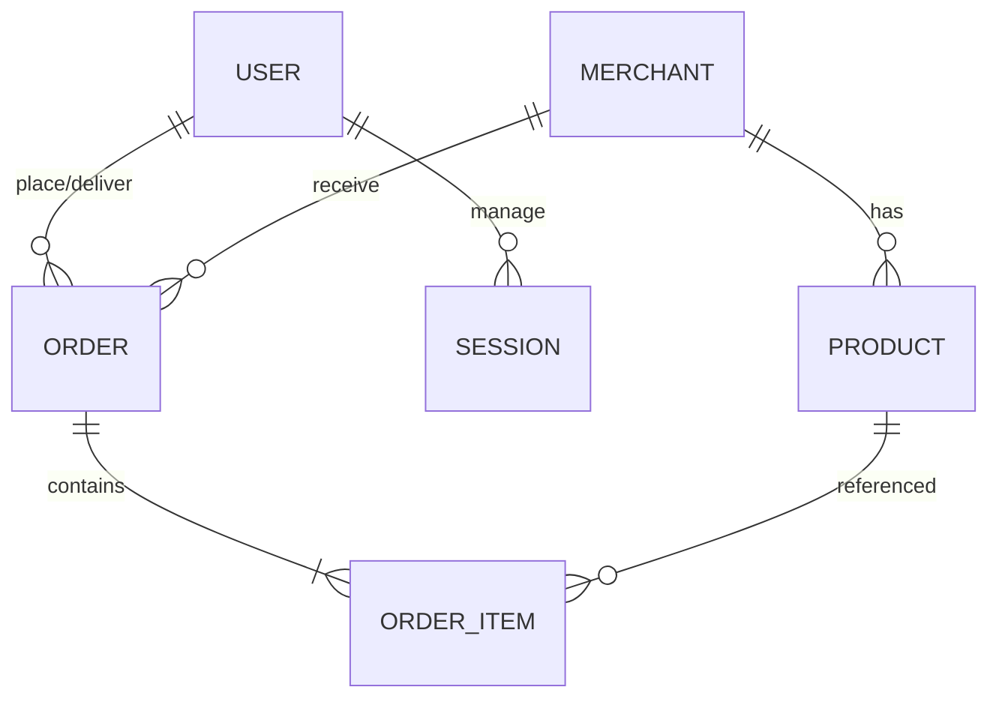

# Skema Database: KoncoKirim (Lite)

Dokumen ini merinci desain database menggunakan **PostgreSQL** dan **Drizzle ORM**. Skema ini dirancang untuk mendukung fitur *offline-first*, *hybrid order flow*, dan *courier auction* sesuai [PRD.md](./PRD.md).

## 1. Tabel Autentikasi (Better-auth)

Tabel ini dikelola oleh Better-auth namun kita menambahkan ekstensi pada tabel `user` untuk kebutuhan bisnis.

### `user`
Menyimpan data identitas semua aktor (Admin, Kurir, Customer).
| Kolom | Tipe Data | Deskripsi |
| :--- | :--- | :--- |
| `id` | text (PK) | UUID format string. |
| `name` | text | Nama lengkap user. |
| `email` | text (Unique) | Digunakan untuk login. |
| `emailVerified` | boolean | Status verifikasi email. |
| `image` | text | URL foto profil. |
| `role` | text | Enum: `ADMIN`, `COURIER`, `CUSTOMER`. |
| `phoneNumber` | text | Nomor WhatsApp aktif. |
| `createdAt` | timestamp | Waktu pendaftaran. |

---

## 2. Core Bisnis

### `merchants`
Representasi warung/UMKM kuliner lokal.
| Kolom | Tipe Data | Deskripsi |
| :--- | :--- | :--- |
| `id` | uuid (PK) | ID unik merchant. |
| `name` | text | Nama warung (Indexed). |
| `address` | text | Alamat fisik di desa. |
| `phoneNumber` | text | Nomor WhatsApp merchant. |
| `isActive` | boolean | Status operasional warung. |
| `adminId` | text (FK) | Admin penanggung jawab (Ref: `user.id`). |

### `products`
Daftar menu makanan/minuman per warung.
| Kolom | Tipe Data | Deskripsi |
| :--- | :--- | :--- |
| `id` | uuid (PK) | ID unik produk. |
| `merchantId` | uuid (FK) | Pemilik produk (Ref: `merchants.id`). |
| `name` | text | Nama menu (Indexed). |
| `price` | integer | Harga dalam Rupiah (e.g. 15000). |
| `imageUrl` | text | URL gambar ringan. |
| `isAvailable` | boolean | Kontrol stok manual oleh Admin. |

---

## 3. Sistem Transaksi & Lelang

### `orders`
Manajemen pesanan dan status pengiriman.
| Kolom | Tipe Data | Deskripsi |
| :--- | :--- | :--- |
| `id` | uuid (PK) | ID unik pesanan. |
| `customerId` | text (FK) | Pemesan (Ref: `user.id`). |
| `merchantId` | uuid (FK) | Warung tujuan (Ref: `merchants.id`). |
| `courierId` | text (FK) | Kurir pemenang lelang (Ref: `user.id`). |
| `status` | text | Enum: `PENDING`, `AUCTIONING`, `DELIVERING`, `COMPLETED`, `CANCELLED`. |
| `totalPrice` | integer | Total harga produk. |
| `deliveryFee` | integer | Biaya antar untuk kurir. |
| `serviceFee` | integer | Biaya layanan untuk Admin desa. |
| `deliveryAddress`| text | Alamat pengantaran spesifik. |
| `waFallbackUsed` | boolean | `true` jika dikirim via WA saat internet mati. |
| `createdAt` | timestamp | Waktu pesanan dibuat. |

### `order_items`
Detail produk di dalam satu pesanan.
| Kolom | Tipe Data | Deskripsi |
| :--- | :--- | :--- |
| `id` | uuid (PK) | ID unik item. |
| `orderId` | uuid (FK) | ID pesanan induk (Ref: `orders.id`). |
| `productId` | uuid (FK) | ID produk (Ref: `products.id`). |
| `quantity` | integer | Jumlah yang dipesan. |
| `priceAtOrder` | integer | Snapshot harga saat transaksi dilakukan. |

---

## 4. Strategi Indeks & Query

Untuk efisiensi tinggi, indeks berikut wajib diimplementasikan:

1.  **Pencarian Lokal:** `CREATE INDEX idx_merchant_name ON merchants(name);`
2.  **Dashboard Admin:** `CREATE INDEX idx_order_status ON orders(status);`
3.  **Lelang Kurir:** `CREATE INDEX idx_order_auction ON orders(merchantId, status) WHERE status = 'AUCTIONING';`
4.  **Riwayat User:** `CREATE INDEX idx_order_customer ON orders(customerId, createdAt DESC);`

## 5. Hubungan Relasi (ERD)

